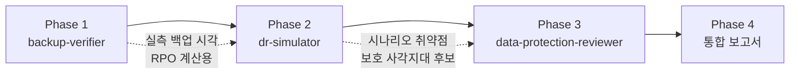

# DR Verification — 백업·재해복구 검증 오케스트레이터

3개 전문 에이전트를 순차 파이프라인으로 실행하여 백업 상태 → 복구 가능성 → 보호 전략을 종합 검증한다.

## 실행 모드: 순차 파이프라인 (Sequential Pipeline)

각 단계의 결과가 다음 단계의 입력이 되므로 반드시 순차 실행한다. 앞 단계에서 발견된 문제가 뒤 단계의 분석 정확도에 영향을 주기 때문이다.



## 에이전트 풀

| 에이전트 | 모델 | 역할 | 색상 |
|---------|------|------|------|
| `backup-verifier` | opus | CronJob 실행 상태, pg_dump 무결성, Restic 스냅샷, R2 동기화 | yellow |
| `dr-simulator` | opus | 복구 시나리오 시뮬레이션, RTO/RPO 계산, 갭 분석 | red |
| `data-protection-reviewer` | opus | PVC 보호, SealedSecrets 키, 외부 SSD, 보존 정책 | cyan |

## 워크플로우

### Phase 1: 백업 검증

백업 인프라의 실행 상태와 산출물 무결성을 확인한다.

```
Agent(
  subagent_type: "backup-verifier",
  model: "opus",
  prompt: "
    백업 시스템 전체 검증을 수행하라.

    검증 대상:
    1. CronJob 실행 상태: postgresql-backup (apps)
    2. pg_dump 파일 무결성: 오늘자 파일 존재 + 크기 확인
    3. 수동 백업: backup.sh 최신 tarball 상태
    4. 보존 정책 준수: 7일 정책 적용 확인

    출력: 마크다운 보고서 (요약 테이블 + 상세 진단 + 발견 문제)
  "
)
```

**Phase 1 → Phase 2 전달 정보:**
- 각 백업의 마지막 성공 시각
- 실패한 백업 항목 (있을 경우)
- RPO 계산에 필요한 실측 데이터

### Phase 2: DR 시뮬레이션

Phase 1의 백업 상태를 반영하여 복구 시나리오를 시뮬레이션한다.

```
Agent(
  subagent_type: "dr-simulator",
  model: "opus",
  prompt: "
    DR 시뮬레이션을 수행하라.

    Phase 1 (백업 검증) 결과:
    ---
    {Phase 1 결과 요약}
    ---

    수행 사항:
    1. docs/disaster-recovery.md의 6개 시나리오(A~F)에 대해 복구 가능성 시뮬레이션
    2. 각 시나리오별 RTO/RPO 계산 (Phase 1의 실측 백업 시각 활용)
    3. DR 문서와 현실 간의 갭 분석
    4. 복구 절차의 전제 조건 충족 여부 검증

    출력: 마크다운 보고서 (시나리오 매트릭스 + 상세 분석 + 갭 목록)
  "
)
```

**Phase 2 → Phase 3 전달 정보:**
- 시나리오별 취약점 목록
- 보호 사각지대 후보
- 데이터 보호 관점의 추가 검증 필요 항목

### Phase 3: 데이터 보호 리뷰

Phase 1~2 결과를 반영하여 데이터 보호 전략을 종합 리뷰한다.

```
Agent(
  subagent_type: "data-protection-reviewer",
  model: "opus",
  prompt: "
    데이터 보호 전략을 종합 리뷰하라.

    Phase 1 (백업 검증) 결과:
    ---
    {Phase 1 결과 요약}
    ---

    Phase 2 (DR 시뮬레이션) 결과:
    ---
    {Phase 2 결과 요약}
    ---

    수행 사항:
    1. PVC 보호 상태 점검 (Reclaim Policy, 백업 커버리지, 용량)
    2. SealedSecrets 키페어 백업 확인
    3. 외부 SSD 상태 점검 (마운트, 사용률, 권한)
    4. 보존 정책 적정성 평가 (3-2-1 규칙)
    5. 보호 사각지대 식별 (백업 없는 PVC, Git 외 수동 리소스)
    6. Phase 2에서 발견된 취약점에 대한 보호 방안 제시

    출력: 마크다운 보고서 (보호 매트릭스 + 상세 점검 + 사각지대 + 권장 조치)
  "
)
```

### Phase 4: 통합 보고서 작성

3개 에이전트 결과를 종합하여 최종 보고서를 작성한다:

```markdown
# 백업·재해복구 검증 통합 보고서

## 종합 건강도: [HEALTHY / AT_RISK / CRITICAL]

## Executive Summary
(3~5문장으로 핵심 상태 요약)

## 검증 결과 매트릭스

| 영역 | 상태 | 핵심 발견 |
|------|------|----------|
| 백업 실행 | ✅/⚠️/❌ | |
| 백업 무결성 | ✅/⚠️/❌ | |
| DR 복구 가능성 | ✅/⚠️/❌ | |
| RTO/RPO 충족 | ✅/⚠️/❌ | |
| 데이터 보호 | ✅/⚠️/❌ | |
| 시크릿 보호 | ✅/⚠️/❌ | |

## 발견된 문제 (심각도순)

### Critical
- [문제] — 영향: ... — 권장 조치: ...

### Warning
- [문제] — 영향: ... — 권장 조치: ...

### Info
- [참고 사항]

## 교차 관심사
(백업 문제 → DR 영향, 보호 갭 → RPO 초과 등 에이전트 간 연결 이슈)

## 액션 아이템
1. [우선순위 1] ...
2. [우선순위 2] ...
3. [우선순위 3] ...

## 다음 검증 권장 시기
(발견된 문제 수와 심각도 기반)
```

## 종합 건강도 판정

| 등급 | 조건 |
|------|------|
| **HEALTHY** | Critical 0개, Warning 2개 이하, 모든 백업 24시간 내 성공 |
| **AT_RISK** | Critical 0개이지만 Warning 3개 이상, 또는 일부 백업 24~48시간 |
| **CRITICAL** | Critical 1개 이상, 또는 핵심 백업 48시간 이상 실패 |

## 에러 핸들링

| 상황 | 대응 |
|------|------|
| 에이전트 실패 | 에러 분석 후 프롬프트 수정하여 1회 재시도 |
| 재실패 | 해당 Phase 스킵, 수집된 결과만으로 부분 보고서 작성, 미검증 영역 명시 |
| 클러스터 접근 불가 | 문서 기반 정적 분석만 수행 (Phase 2만 실행 가능) |
| Phase 1 실패 | Phase 2에 "백업 상태 미확인" 전달, DR 시뮬레이션은 문서 기반으로 진행 |

## 테스트 시나리오

### 정상 흐름
1. **입력**: "백업 검증해줘" 또는 "DR 점검"
2. Phase 1: backup-verifier가 CronJob 5개 항목 검증 → 전체 PASS
3. Phase 2: dr-simulator가 6개 시나리오 시뮬레이션 → 시나리오 E에서 Warning
4. Phase 3: data-protection-reviewer가 보호 전략 리뷰 → SSD 사용률 75% Warning
5. 통합 보고서: AT_RISK (Warning 2개), 액션 아이템 2개

### 문제 발견 흐름
1. **입력**: "전체 백업 상태 확인"
2. Phase 1: postgresql-backup CronJob 48시간 미실행 → FAIL
3. Phase 2: 시나리오 C/D RPO가 48시간으로 확대 → Critical
4. Phase 3: 오프사이트 백업 부재 경고 → Critical
5. 통합 보고서: CRITICAL, 즉시 조치 필요 항목 3개
