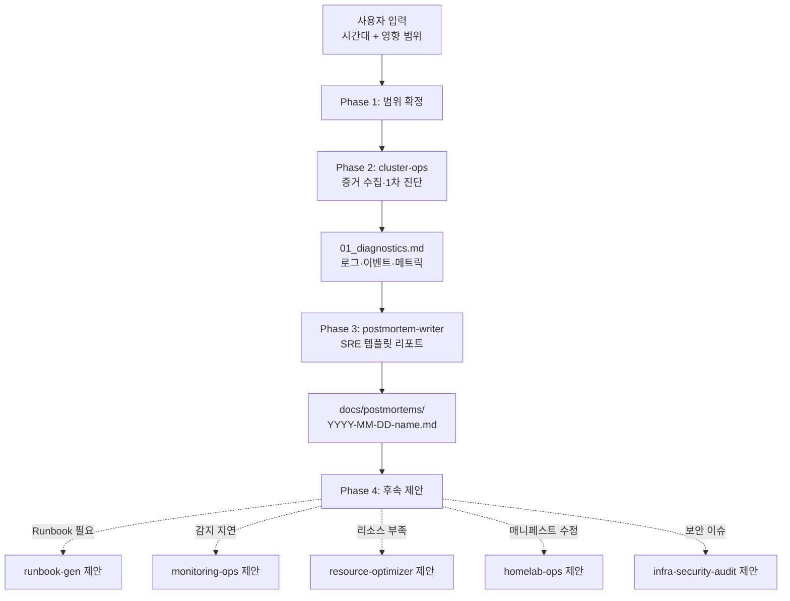

# Incident Postmortem — 사후 분석 오케스트레이터

장애 종료 후 **증거 수집 → 분석 → 표준 리포트 작성 → 후속 조치 제안**의 전 과정을 조율한다.

## 실행 모드: 순차 파이프라인

증거 수집 결과가 분석 품질을 좌우하므로 순차 실행. 병렬·팀 모드는 증거 일관성을 해칠 수 있어 부적합.

## 에이전트 풀

| 에이전트 | subagent_type | 역할 | 출력 |
|---------|--------------|------|------|
| `cluster-ops` | cluster-ops | 로그·이벤트·메트릭 수집, 근본 원인 진단 | `_workspace/01_diagnostics.md` |
| `postmortem-writer` | postmortem-writer | Google SRE 템플릿 기반 리포트 작성 | `docs/postmortems/{date}-{name}.md` |

## 워크플로우

### Phase 1: 범위 확정

사용자로부터 확정한다 (부족하면 질문):
- 인시던트 식별자: 날짜(YYYY-MM-DD) + 짧은 이름 (예: `2026-04-17-adguard-oom`)
- 장애 시간대: 시작~종료 (UTC 권장)
- 영향 범위: 어느 앱·네임스페이스·사용자
- 심각도 초안: SEV-1 ~ SEV-4

`_workspace/00_scope.md`에 저장.

### Phase 2: 증거 수집

```
Agent(
  subagent_type: "cluster-ops",
  model: "opus",
  prompt: "다음 장애의 증거를 사후 분석용으로 수집하라.
    - 시간대: {start_utc} ~ {end_utc}
    - 영향 앱: {apps}
    - 심각도: {severity}

    수집 범위:
    1. Pod 로그 (kubectl logs, VictoriaLogs)
    2. kubectl events --sort-by='.lastTimestamp'
    3. VictoriaMetrics 시계열 (메모리, CPU, 재시작 횟수)
    4. Grafana 알림 이력 (Telegram 메시지 포함 여부)
    5. ArgoCD Application status 스냅샷 (해당 시점의 sync.status, health.status)
    6. 관련 매니페스트의 해당 시점 커밋 SHA

    타임라인은 UTC 시각 기준으로 정리하라.
    근본 원인 가설이 있으면 명시하되 확신도(%)를 붙여라.
    결과를 _workspace/01_diagnostics.md에 저장하라."
)
```

### Phase 3: Postmortem 작성

```
Agent(
  subagent_type: "postmortem-writer",
  model: "opus",
  prompt: "_workspace/00_scope.md와 _workspace/01_diagnostics.md를 읽고
    Google SRE 표준 Postmortem 리포트를 작성하라.

    필수 준수:
    - Blameless 원칙 (개인이 아닌 시스템·프로세스 관점)
    - UTC 타임라인 + KST 병기
    - 5 Whys 근본 원인 분석
    - What went well / wrong / lucky 3축 명시
    - SMART 기준 Action Items

    출력 경로: docs/postmortems/{YYYY-MM-DD}-{short-name}.md
    기존 유사 인시던트가 있으면 'Related' 섹션에 링크 포함."
)
```

### Phase 4: 후속 제안

Postmortem 결과의 Action Items를 분석하여 다음 판단을 사용자에게 제안한다 (자동 호출 금지 — 사용자 판단을 존중):

1. **Runbook 신설 필요**: 동일 유형 장애 재발 시 대응 절차가 없으면 `runbook-gen` 호출 제안
2. **감지 지연 큼**: 탐지 시각 갭이 5분 이상이면 `monitoring-ops`로 알람 추가 제안
3. **리소스 부족이 원인**: OOM·CPU throttling·Pending이 원인이면 `resource-optimizer` 호출 제안
4. **매니페스트·설정 수정 필요**: 구성 오류였다면 수정사항을 `homelab-ops`로 전달 제안
5. **보안 관련**: 시크릿 노출·권한 문제면 `infra-security-audit` 호출 제안

사용자에게 최종 보고:
- Postmortem 파일 경로
- 핵심 근본 원인 1줄
- Action Items 개수 (P0/P1/P2별)
- 후속 제안 목록

## 데이터 흐름



## 에러 핸들링

| 상황 | 대응 |
|------|------|
| cluster-ops가 과거 로그 미접근 (retention 초과) | VictoriaLogs 15일·VictoriaMetrics 30일 경계 확인. 부분 증거로 진행하고 postmortem에 "증거 제한" 명시 |
| Grafana 알림 이력 누락 | Telegram 채널 수동 확인 요청. 찾으면 timeline에 추가, 못 찾으면 Action Item으로 "알림 이력 아카이브 자동화" 추가 |
| 원인 특정 불가 | postmortem-writer가 추정 원인 + 확신도 명시. 추가 모니터링 Action Item 권장 |
| 타임스탬프 불일치 (로그 vs 알림 vs 사용자 신고) | 양쪽 출처 병기, 신뢰도 차이 표시 |
| 여러 장애가 얽힘 (cascade) | 각 장애별 섹션 + "cascade 관계" 별도 섹션으로 통합 postmortem 1개 작성 |

## 기존 스킬/에이전트 연동

| 리소스 | 연동 방식 |
|--------|----------|
| `cluster-diagnose` 스킬 | cluster-ops가 증거 수집 체크리스트로 참조 |
| `homelab-ops` 스킬 | 매니페스트 수정 필요 시 Phase 4에서 제안 |
| `runbook-gen` 스킬 | 신규 Runbook 필요 시 Phase 4에서 제안 |
| `monitoring-ops` 스킬 | 감지 갭 있을 때 Phase 4에서 제안 |
| `resource-optimizer` 스킬 | 리소스 부족 원인일 때 Phase 4에서 제안 |
| `docs/postmortems/` | 최종 산출물 저장 경로 (없으면 생성) |

## 테스트 시나리오

### 정상 흐름: OOM 장애

1. **입력**: "어제 20:15~20:45 UTC adguard OOM 건 postmortem 작성해줘"
2. Phase 1: 범위 확정 — adguard, SEV-3, DNS 일시 장애
3. Phase 2: cluster-ops가 kubectl events, 메모리 메트릭, ArgoCD 상태 수집. OOMKilled 확인, 메모리 request 64Mi/limit 128Mi에서 실사용 150Mi 확인
4. Phase 3: postmortem-writer가 SRE 템플릿으로 리포트 작성. 5 Whys로 "memory limit 설정 기준이 실사용 미반영" 도출. Action Item에 "피크24h×1.3 기준 재조정" 포함
5. Phase 4: resource-optimizer 호출 제안 (메모리 request/limit 재조정)
6. 출력: `docs/postmortems/2026-04-17-adguard-oom.md` + 후속 제안 1건

### 에러 흐름: 증거 제한 (오래된 장애)

1. **입력**: "20일 전 Tunnel 끊김 건 postmortem"
2. Phase 2: VictoriaMetrics는 30일이라 메트릭 있음. VictoriaLogs는 15일 retention으로 로그 누락. Grafana 알림 이력은 Telegram 스크롤로 수동 수집
3. Phase 3: "로그 증거 제한" 명시. Timeline에 일부 "?" 표시. Action Item: "VictoriaLogs retention 확대 또는 중요 로그 장기 보관 방안" 추가
4. Phase 4: monitoring-ops 호출 제안 (로그 보존 정책 개선)
