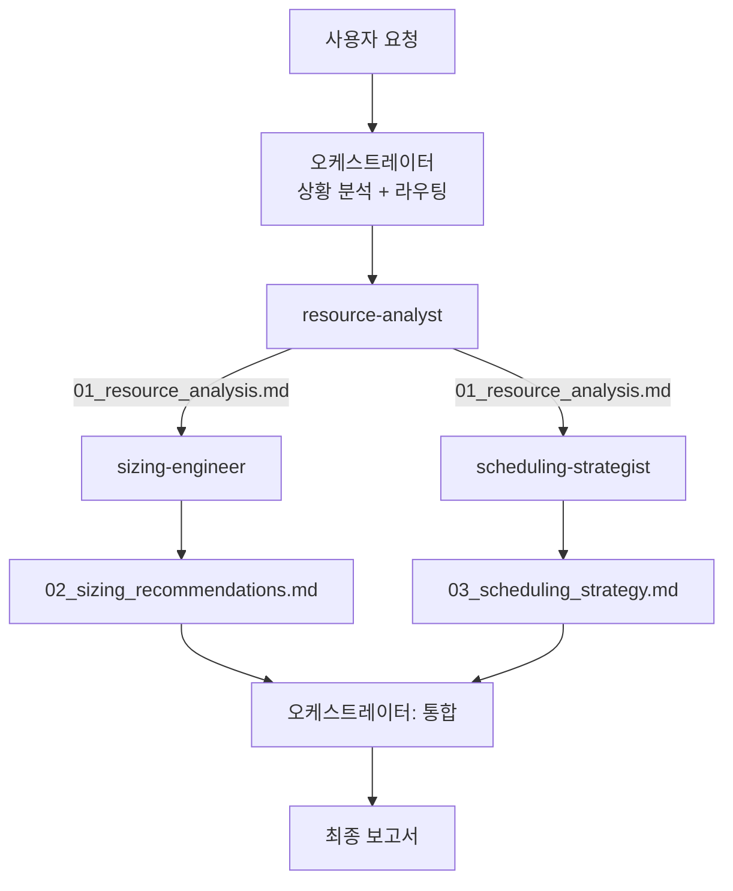

# Resource Optimizer — 클러스터 리소스 최적화 오케스트레이터

K8s 단일 노드 클러스터(Mac Mini M4, OrbStack 12Gi RAM, 가용 ~9.7Gi)의 리소스를 최적화하는 전문가 풀 오케스트레이터. 상황에 따라 적절한 전문가를 선택 호출한다.

## 실행 모드: 서브 에이전트 (전문가 풀)

## 전문가 구성

| 에이전트 | subagent_type | 역할 | 출력 |
|---------|--------------|------|------|
| resource-analyst | resource-analyst | kubectl top + PromQL로 실사용량 분석, 과잉/부족 식별 | `_workspace/01_resource_analysis.md` |
| sizing-engineer | sizing-engineer | 피크24h x 1.3 기준 request/limit 재조정, QoS 최적화 | `_workspace/02_sizing_recommendations.md` |
| scheduling-strategist | scheduling-strategist | PriorityClass, ResourceQuota, 퇴거 순서 설계 | `_workspace/03_scheduling_strategy.md` |

## 라우팅 규칙

사용자 요청을 분석하여 필요한 전문가만 호출한다. 불필요한 전문가는 호출하지 않아 토큰을 절약한다.

| 상황 | 호출 전문가 | 순서 |
|------|-----------|------|
| **OOM/CrashLoop 발생** | analyst → sizing-engineer | 순차 (원인 분석 → 사이징 해결) |
| **리소스 부족/Pending** | analyst → sizing-engineer + scheduling-strategist | 순차 → 병렬 |
| **새 앱 추가 예정** | analyst → sizing-engineer → scheduling-strategist | 순차 (여유 확인 → 배분 → 우선순위) |
| **정기 리소스 점검** | analyst → sizing-engineer + scheduling-strategist | 순차 → 병렬 |
| **우선순위/퇴거만** | scheduling-strategist | 단독 |
| **현재 상태 확인만** | analyst | 단독 |

## 워크플로우

### Phase 1: 상황 분석
1. 사용자 요청에서 상황 파악 (OOM, 리소스 부족, 새 앱, 정기 점검 등)
2. 라우팅 규칙에 따라 호출할 전문가와 순서 결정
3. `_workspace/` 디렉토리 생성

### Phase 2: 데이터 수집

analyst가 필요한 경우 먼저 실행한다. 이후 전문가들이 이 데이터를 기반으로 작업한다.

```
Agent(
  description: "클러스터 리소스 분석",
  prompt: "<구체적 분석 대상과 범위>. 결과를 _workspace/01_resource_analysis.md에 저장하라.",
  subagent_type: "resource-analyst",
  model: "opus"
)
```

### Phase 3: 전문가 실행

라우팅 규칙에 따라 필요한 전문가를 호출한다.

**sizing-engineer (필요 시):**
```
Agent(
  description: "리소스 사이징 조정",
  prompt: "_workspace/01_resource_analysis.md를 읽고 request/limit 재조정 권장사항을 작성하라. 결과를 _workspace/02_sizing_recommendations.md에 저장하라.",
  subagent_type: "sizing-engineer",
  model: "opus"
)
```

**scheduling-strategist (필요 시):**
```
Agent(
  description: "스케줄링 전략 설계",
  prompt: "_workspace/의 분석 결과를 읽고 PriorityClass, ResourceQuota, 퇴거 순서를 설계하라. 결과를 _workspace/03_scheduling_strategy.md에 저장하라.",
  subagent_type: "scheduling-strategist",
  model: "opus"
)
```

> sizing-engineer와 scheduling-strategist가 동시에 필요하면 `run_in_background: true`로 병렬 실행한다. 둘 다 analyst의 출력만 읽으므로 병렬 실행에 문제없다.

### Phase 4: 통합 보고서

전문가 산출물을 Read로 수집하고 통합 보고서를 생성한다:

```markdown
# 클러스터 리소스 최적화 보고서

## 요약
- 상황: {분석된 상황}
- 핵심 발견: {과잉/부족/위험 워크로드 수}
- 권장 변경: {변경 필요 워크로드 수}

## 1. 리소스 분석 결과
{analyst 요약 — 노드 상태, 과잉/부족 워크로드}

## 2. 사이징 권장사항
{sizing-engineer 요약 — 변경 대상, 전후 비교, QoS 재배치}

## 3. 스케줄링 전략
{scheduling-strategist 요약 — PriorityClass, ResourceQuota, 퇴거 시뮬레이션}

## 4. 적용 가이드
{변경 우선순위, Git 커밋 기반 적용 방법}
- ArgoCD selfHeal이 kubectl 변경을 원복하므로, 반드시 Git으로 매니페스트를 수정한다

## 5. 주의사항
{위험 요소, 미수집 데이터, 제한 사항}
```

### Phase 5: 정리
1. `_workspace/` 보존 (감사 추적용)
2. 사용자에게 통합 보고서 제공

## 데이터 흐름



## 에러 핸들링

| 상황 | 전략 |
|------|------|
| analyst 실패 | 1회 재시도. 재실패 시 kubectl top만으로 기본 분석 시도 |
| sizing-engineer 실패 | analyst 결과만 보고, "수동 right-sizing 필요" 명시 |
| scheduling-strategist 실패 | analyst+sizing 결과로 보고, 스케줄링 섹션 미포함 명시 |
| VictoriaMetrics 접근 불가 | analyst에게 kubectl 기반 스냅샷 분석 지시, 시계열 분석 불가 명시 |
| 데이터 상충 | 출처 병기, 삭제하지 않음 |
| 전문가 과반 실패 | 사용자에게 알리고 부분 결과 제공 |

## 환경 제약
- **노드**: Mac Mini M4, OrbStack K3s 단일 노드
- **총 메모리**: 12Gi (OrbStack 할당), 가용 ~9.7Gi (kubelet+apiserver 최대 ~2.3Gi)
- **ArgoCD**: selfHeal 활성 — kubectl 직접 변경은 원복됨, Git으로 매니페스트 수정 필수
- **모니터링**: VictoriaMetrics (vmsingle)

## 테스트 시나리오

### 정상 흐름: 정기 리소스 점검
1. 사용자: "클러스터 리소스 최적화해줘"
2. Phase 1: 상황 → "정기 점검" → analyst + sizing-engineer + scheduling-strategist
3. Phase 2: analyst 실행 → 분석 보고서 생성
4. Phase 3: sizing-engineer + scheduling-strategist 병렬 실행
5. Phase 4: 3개 산출물 통합 → 최종 보고서
6. 예상 결과: 워크로드별 변경 권장사항 + 적용 가이드 + 스케줄링 전략

### 에러 흐름: VictoriaMetrics 접근 불가
1. 사용자: "리소스 분석해줘"
2. Phase 2: analyst가 PromQL 쿼리 실패
3. analyst가 kubectl top으로 대체 분석 수행
4. 보고서에 "시계열 데이터 미수집 — kubectl 스냅샷 기반" 명시
5. sizing-engineer가 스냅샷 데이터로 보수적 권장 (피크 추정 불가 → 현재값 x 1.5)
