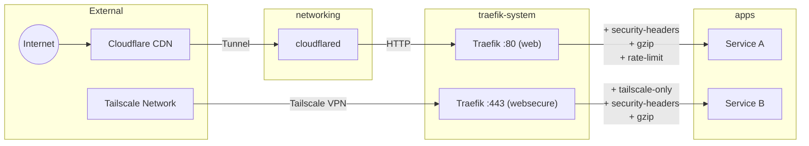
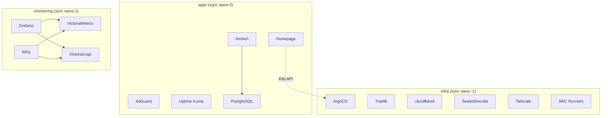
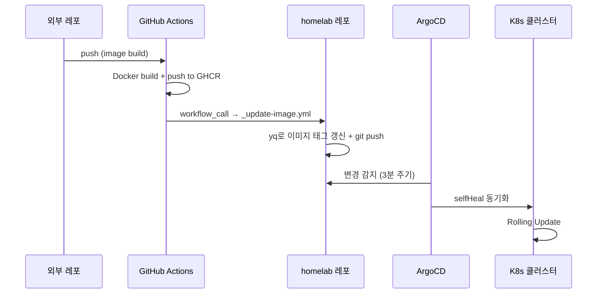
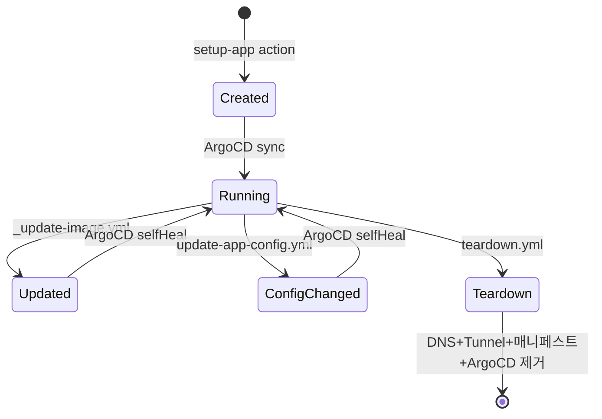
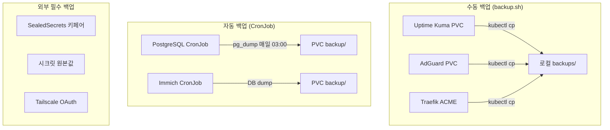
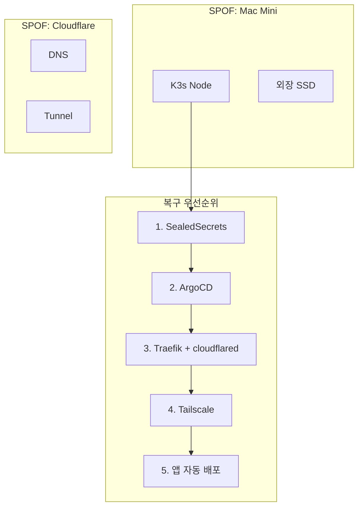

# Mermaid 다이어그램 패턴

이 프로젝트의 아키텍처를 시각화하기 위한 Mermaid 다이어그램 패턴과 프로젝트 고유 데이터.

---

## 1. 네트워크 토폴로지

화살표 라벨에 Traefik 미들웨어 체인을 명시한다.

---

## 2. 서비스 의존성 맵

실선(-->)은 런타임 의존, 점선(-.->)은 데이터 조회 의존.

---

## 3. 배포 파이프라인

---

## 4. 앱 라이프사이클

---

## 5. 백업/복원 흐름

---

## 6. 장애 도메인

장애 도메인 다이어그램에서는 SPOF를 빨간색 서브그래프, 복구 순서를 번호로 명시한다.

---

## 작성 규칙

### 서브그래프
- 네임스페이스 또는 계층별로 서브그래프를 그룹핑
- 서브그래프 제목에 sync wave 또는 역할을 명시

### 화살표
- 실선(`-->`): 런타임 의존, 트래픽 흐름
- 점선(`-.->`): 데이터 조회, 참조 관계
- 굵은선(`==>`): 크리티컬 경로

### 라벨
- 프로토콜/포트: `|"HTTP :80"|`
- 미들웨어/처리: `|"+ gzip\n+ rate-limit"|`
- 조건: `|"실패 시"|`

### 크기 제어
- 다이어그램당 노드 15개 이내
- 초과 시 overview(전체 구조) + detail(영역별 상세)로 분할
- overview에서 detail로 링크: `자세한 내용은 [네트워크 상세](#네트워크-상세) 참조`
