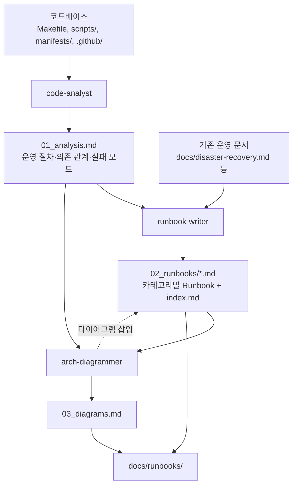

# Runbook Gen — 운영 Runbook 생성 오케스트레이터

코드베이스의 운영 지식을 추출하여 표준 형식 Runbook + 아키텍처 다이어그램으로 문서화한다.

## 실행 모드: 서브 에이전트

파이프라인 패턴(분석→작성→다이어그램)은 순차 의존이 강하고, 이전 에이전트의 산출물이 다음 에이전트의 입력이므로 서브 에이전트가 적합하다.

## 에이전트 구성

| 에이전트 | subagent_type | 역할 | 출력 |
|---------|--------------|------|------|
| `code-analyst` | code-analyst | 코드에서 운영 절차 추출 | `_workspace/01_analysis.md` |
| `runbook-writer` | runbook-writer | 표준 형식 Runbook 작성 | `_workspace/02_runbooks/*.md` |
| `arch-diagrammer` | arch-diagrammer | Mermaid 다이어그램 생성 | `_workspace/03_diagrams.md` + Runbook 내 삽입 |

## 워크플로우

### Phase 1: 준비
1. 사용자 입력 분석 — Runbook 범위 파악:
   - **전체 생성**: 클러스터 전체 운영 Runbook 세트
   - **카테고리 지정**: 장애 대응, 백업/복원, 배포 등 특정 영역
   - **특정 시나리오**: "OOM 장애 대응 Runbook 만들어줘" 등
2. `_workspace/` 디렉토리 생성
3. 범위를 `_workspace/00_scope.md`에 저장

### Phase 2: 코드 분석 (code-analyst)

```
Agent(
  subagent_type: "code-analyst",
  model: "opus",
  prompt: "다음 범위의 운영 절차를 코드에서 추출하라: [scope].
    분석 대상:
    - Makefile (운영 명령어)
    - scripts/ (setup.sh, seal-secret.sh, backup.sh)
    - .github/workflows/ + .github/actions/ (CI/CD 절차)
    - .github/scripts/manage-tunnel-ingress.sh (Tunnel 관리)
    - docs/disaster-recovery.md (기존 복구 절차)
    - manifests/ (서비스 의존 관계, 네트워크 토폴로지)
    - terraform/ (DNS/인프라 관리)
    - .claude/skills/cluster-diagnose/SKILL.md (진단 체크리스트)
    결과를 _workspace/01_analysis.md에 저장하라."
)
```

**산출물**: `_workspace/01_analysis.md` — 추출된 운영 절차, 의존 관계 맵, 실패 모드 카탈로그

### Phase 3: Runbook 작성 (runbook-writer)

```
Agent(
  subagent_type: "runbook-writer",
  model: "opus",
  prompt: "_workspace/01_analysis.md의 분석 결과를 기반으로 Runbook을 작성하라.
    Runbook 템플릿: .claude/skills/runbook-gen/references/runbook-template.md
    기존 운영 문서도 직접 읽어 통합하라:
    - docs/disaster-recovery.md
    - Makefile
    - .claude/skills/cluster-diagnose/SKILL.md
    카테고리별로 _workspace/02_runbooks/ 디렉토리에 저장하라.
    목차 파일 _workspace/02_runbooks/index.md도 생성하라."
)
```

**산출물**: `_workspace/02_runbooks/` — 카테고리별 Runbook + index.md

### Phase 4: 다이어그램 생성 (arch-diagrammer)

```
Agent(
  subagent_type: "arch-diagrammer",
  model: "opus",
  prompt: "_workspace/01_analysis.md의 의존 관계와 _workspace/02_runbooks/의 Runbook을 읽고,
    Mermaid 다이어그램을 생성하라.
    다이어그램 패턴: .claude/skills/runbook-gen/references/diagram-patterns.md
    필수 다이어그램:
    1. 네트워크 토폴로지 (외부 접근 경로)
    2. 서비스 의존성 맵 (장애 영향 범위)
    3. 배포 파이프라인 (코드→프로덕션 흐름)
    4. 백업/복원 흐름
    전체 다이어그램을 _workspace/03_diagrams.md에 저장하라.
    각 Runbook에 관련 다이어그램도 삽입하라."
)
```

**산출물**: `_workspace/03_diagrams.md` + Runbook 파일 내 다이어그램 삽입

### Phase 5: 통합 및 최종 출력
1. 전체 산출물을 Read로 확인
2. Runbook 간 크로스레퍼런스 확인 (링크 유효성)
3. 최종 산출물을 사용자 지정 경로로 이동 (기본: `docs/runbooks/`)
4. 사용자에게 결과 요약 전달:
   - 생성된 Runbook 목록
   - 포함된 다이어그램 목록
   - 기존 문서 대비 추가된 운영 지식

## 데이터 흐름



## 에러 핸들링

| 상황 | 전략 |
|------|------|
| code-analyst 실패 | 1회 재시도. 재실패 시 기존 운영 문서만으로 runbook-writer 진행 |
| runbook-writer 실패 | 1회 재시도. 재실패 시 분석 결과만 사용자에게 전달 |
| arch-diagrammer 실패 | 1회 재시도. 재실패 시 다이어그램 없이 Runbook만 전달 |
| 분석 결과 부실 | runbook-writer가 원본 파일을 직접 읽어 보완 |
| 기존 문서와 코드 상충 | 코드(현재 상태)를 우선, 문서(과거 상태)는 "참고" 태그 |

## 기존 자원 연동

| 리소스 | 연동 방식 |
|--------|----------|
| `docs/disaster-recovery.md` | runbook-writer가 직접 Read하여 Runbook에 통합 |
| `Makefile` | code-analyst가 타겟 추출, runbook-writer가 명령어로 참조 |
| `cluster-diagnose` 스킬 | runbook-writer가 진단 체크리스트를 Runbook 진단 섹션에 통합 |
| `cluster-ops` 에이전트 | 진단 명령어와 원칙을 참조 (직접 호출 안 함) |
| `scripts/*.sh` | code-analyst가 절차 추출, Runbook에서 스크립트 호출 명령 포함 |

## 테스트 시나리오

### 정상 흐름: 전체 Runbook 세트 생성
1. **입력**: "홈랩 전체 운영 Runbook 만들어줘"
2. Phase 1: 범위 = 전체 클러스터
3. Phase 2: code-analyst가 6개 카테고리 절차 추출
4. Phase 3: runbook-writer가 카테고리별 10-15개 Runbook 생성
5. Phase 4: arch-diagrammer가 4개 핵심 다이어그램 + Runbook 내 삽입
6. Phase 5: `docs/runbooks/`에 최종 출력
7. 예상 결과: index.md + 카테고리별 Runbook + diagrams.md

### 에러 흐름: 분석 불충분
1. **입력**: "백업/복원 Runbook 만들어줘"
2. Phase 2: code-analyst가 backup.sh + disaster-recovery.md 분석
3. 분석 결과에 PostgreSQL CronJob 절차가 누락
4. Phase 3: runbook-writer가 01_analysis.md 확인 → 누락 감지 → manifests/monitoring/ 직접 읽어 보완
5. 보완된 내용으로 Runbook 작성 완료
