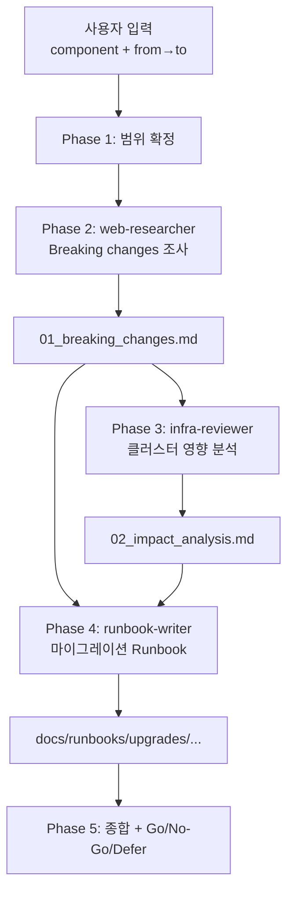

# Upgrade Planner — Major 업그레이드 계획 오케스트레이터

Renovate로 커버되지 않는 major 업그레이드(ArgoCD v2→v3, Traefik v3→v4, K3s 버전 점프 등)의 영향을 분석하고 안전한 마이그레이션 절차를 설계한다.

## 실행 모드: 순차 파이프라인

각 Phase 결과가 다음 Phase의 입력. 기존 에이전트 3명만 활용 — **신규 에이전트 불필요**.

## 에이전트 풀

| 에이전트 | subagent_type | 역할 | 출력 |
|---------|--------------|------|------|
| `web-researcher` | web-researcher | 공식 release notes, breaking changes, migration guide 수집 | `_workspace/01_breaking_changes.md` |
| `infra-reviewer` | infra-reviewer | 현재 클러스터 구성의 breaking change 영향 분석 | `_workspace/02_impact_analysis.md` |
| `runbook-writer` | runbook-writer | 마이그레이션 + 롤백 절차 문서화 | `docs/runbooks/upgrades/{component}-{version}.md` |

## 워크플로우

### Phase 1: 업그레이드 범위 확정

사용자로부터 확정한다 (부족하면 질문):
- 대상 컴포넌트 (예: ArgoCD, Traefik, K3s, cert-manager, SealedSecrets)
- 현재 버전 → 목표 버전
- 업그레이드 사유: 보안 패치 / 기능 / EOL 대응 / 의존성 호환성
- 허용 다운타임 창 (예: 평일 새벽 30분)

`_workspace/00_scope.md`에 저장.

### Phase 2: Breaking Change 조사

```
Agent(
  subagent_type: "web-researcher",
  model: "opus",
  prompt: "{component} {from_version} → {to_version} 업그레이드 정보를 수집하라.

    수집 대상 (우선순위 순):
    1. 공식 release notes (모든 중간 major/minor 버전 포함)
    2. Migration guide / Upgrade guide 공식 문서
    3. Breaking changes 전수 목록
    4. 폐지된(deprecated) API, flag, 설정 필드
    5. 새 필수 설정 (이전엔 기본값이었던 것)
    6. GitHub Issues 중 해당 업그레이드 관련 주요 이슈·해결 여부
    7. 커뮤니티(Reddit/HN) 실사용 경험 (있는 경우)

    각 항목에 공식 소스 URL과 발행일 명시.
    결과를 _workspace/01_breaking_changes.md에 저장하라.
    구조: Critical / Warning / Info 분류 + 각 항목의 영향도 추정."
)
```

### Phase 3: 클러스터 영향 분석

```
Agent(
  subagent_type: "infra-reviewer",
  model: "opus",
  prompt: "_workspace/01_breaking_changes.md를 읽고
    현재 홈랩 클러스터가 이 업그레이드로 영향받는 부분을 분석하라.

    분석 대상 (컴포넌트별로 필요한 영역만):
    - manifests/infra/{component}/ (대상 컴포넌트 자체)
    - manifests/{apps,monitoring}/ (컴포넌트에 의존하는 매니페스트)
    - argocd/applications/ (ArgoCD 업그레이드 시)
    - terraform/ (Cloudflare 관련 시)
    - .github/workflows/ (CI 의존성)

    프로젝트 컨벤션 참조: .claude/skills/homelab-ops/references/project-conventions.md

    각 breaking change마다:
    - 영향 판정: 영향 받음 / 받지 않음 / 확인 필요
    - 영향 받으면 구체적 파일:라인 식별
    - 수정 방향 제안
    - 변경 후 검증 방법

    결과를 _workspace/02_impact_analysis.md에 저장."
)
```

### Phase 4: 마이그레이션 + 롤백 절차 문서화

```
Agent(
  subagent_type: "runbook-writer",
  model: "opus",
  prompt: "_workspace/01_breaking_changes.md와 _workspace/02_impact_analysis.md를 바탕으로
    업그레이드 Runbook을 작성하라.

    Runbook 템플릿: .claude/skills/runbook-gen/references/runbook-template.md

    필수 섹션:
    1. 사전 점검 체크리스트 (백업 최신 여부, 관련 의존 앱 상태, 대체 경로 확인)
    2. 단계별 마이그레이션 절차 (각 단계에 검증 포인트)
    3. 트래픽 전환 전략 (카나리 / 블루그린 / 무중단 불가 중 선택)
    4. 롤백 절차 (트리거 조건 + 복구 단계 + 롤백 후 검증)
    5. 업그레이드 후 검증 체크리스트
    6. 예상 다운타임 및 허용 창과의 적합성 판정
    7. Known Gotchas (02_impact_analysis의 영향 받음 항목 기반)

    출력 경로: docs/runbooks/upgrades/{component}-{to_version}.md
    워크스페이스에도 _workspace/03_migration_runbook.md로 사본 저장."
)
```

### Phase 5: 결과 종합 및 Go/No-Go 권고

사용자에게 다음을 전달한다:

1. **Breaking changes 요약**: Critical 개수, 클러스터에 실제 영향 N건
2. **영향받는 파일 목록** (impact_analysis의 핵심)
3. **마이그레이션 Runbook 경로**
4. **예상 다운타임 vs 허용 창 판정**: 적합 / 창 확대 필요 / 무중단 불가
5. **최종 권고**:
   - **Go**: breaking change 대응 가능 + 다운타임 허용 범위
   - **Defer**: 영향은 크지 않으나 지금은 우선순위 낮음
   - **No-Go**: Blocker 존재 — 선결 조건 제시

## 데이터 흐름



## 에러 핸들링

| 상황 | 대응 |
|------|------|
| web-researcher가 공식 문서 못 찾음 | GitHub release + 커뮤니티 소스 대체, 신뢰도 낮음 경고 포함 |
| infra-reviewer가 영향 판단 불가 | "확인 필요" 표시 + 관련 매니페스트 경로 나열 + 사용자 직접 검토 요청 |
| 예상 다운타임 > 허용 창 | "무중단 불가" 판정 + 창 확대 / 단계적 업그레이드 / 블루그린 등 대안 제시 |
| Breaking change 중 호환 불가 항목 | "Blocker" 플래그 + 선결 조건 제시 (예: 선행 컴포넌트 업그레이드, CRD 마이그레이션) |
| 다중 컴포넌트 의존 업그레이드 (cascade) | 업그레이드 순서도 포함, 각 단계별 runbook 분리 작성 |

## 프로젝트 레퍼런스

에이전트 프롬프트에 경로 포함 권장:
- `.claude/skills/homelab-ops/references/project-conventions.md` — 프로젝트 컨벤션
- `.claude/skills/runbook-gen/references/runbook-template.md` — Runbook 서식
- `docs/disaster-recovery.md` — 복구 절차 (롤백 섹션 작성 시 참조)
- `manifests/infra/` — 대상 컴포넌트 매니페스트 위치

## 기존 스킬/에이전트 연동

| 리소스 | 연동 방식 |
|--------|----------|
| Renovate | patch/minor는 Renovate가 처리. upgrade-planner는 major 전용 |
| `terraform-iac` | Cloudflare provider 업그레이드는 terraform-iac가 처리. 이 스킬은 K8s 컴포넌트 major 전용 |
| `gha-cicd` | CI 관련 업그레이드(actions 버전)는 gha-cicd가 담당 |
| `dr-verification` | 업그레이드 전 백업 상태 점검에 활용 권장 |

## 테스트 시나리오

### 정상 흐름: ArgoCD major 업그레이드

1. **입력**: "ArgoCD v2.14 → v3.0 업그레이드 계획해줘. 허용 창 주말 새벽 1시간"
2. Phase 2: web-researcher가 v3 release notes, migration guide, breaking changes 수집 → `sourceNamespaces` 필드 제거, Application CRD v1alpha1 폐지 등 확인
3. Phase 3: infra-reviewer가 `argocd/root.yaml`, `argocd/applications/**` 전수 검사 → 사용 중인 필드 2건 영향 확인
4. Phase 4: runbook-writer가 CRD 마이그레이션 + ArgoCD 재배포 + 검증 절차 Runbook 작성. 예상 다운타임 15분
5. Phase 5: **Go 권고** (다운타임 15분 < 허용 1시간, Blocker 없음)

### 에러 흐름: Breaking change로 Blocker

1. **입력**: "Traefik v3 → v4 업그레이드"
2. Phase 2: v4가 Tailscale IP 처리 방식 변경 발견 (IPWhiteList middleware 포맷 변경)
3. Phase 3: 현재 `tailscale-only` middleware가 비호환 판정 — 매니페스트 전면 재작성 필요
4. Phase 4: runbook-writer가 "middleware 재작성 + 단계적 전환" 포함. 예상 다운타임 1시간 이상
5. Phase 5: **No-Go 판정** — 선결 조건: middleware 리팩토링 + 스테이징 환경 검증. "2026-Q3 이후 재검토" 권고

### 에러 흐름: 공식 문서 부재

1. **입력**: "OrbStack 1.x → 2.x 업그레이드 계획"
2. Phase 2: web-researcher가 공식 changelog 확인, 상세 breaking change 없음 (제품 특성상)
3. Phase 3: infra-reviewer가 외부 자료 부족으로 "확인 필요" 다수 표시
4. Phase 5: **Defer 권고** — 실환경 dry-run 가능한 별도 OrbStack VM에서 검증 후 재평가 제안
